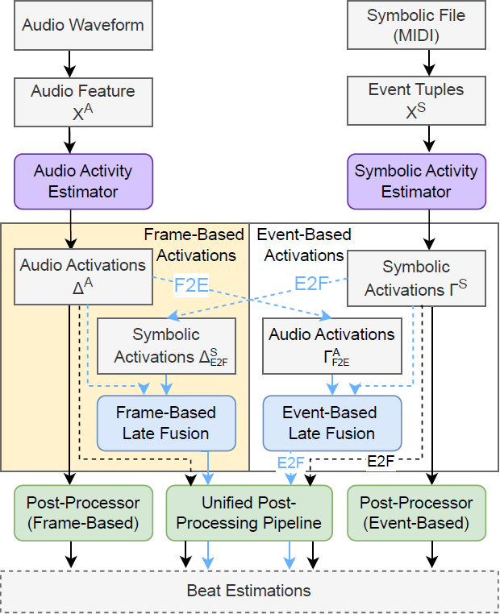
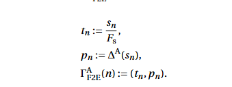
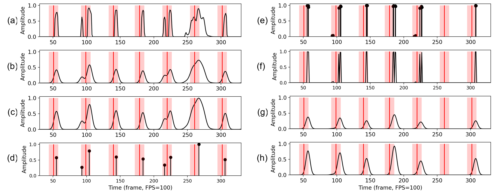
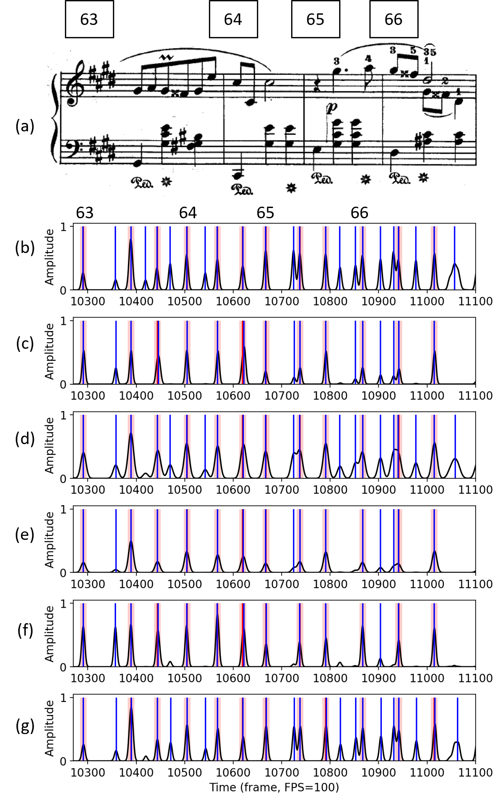
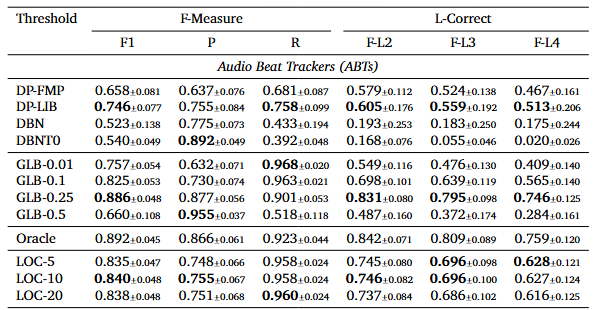

## Cross-Modal Approaches to Beat Tracking: A Case Study on Chopin Mazurkas

|[Paper](https://doi.org/10.5334/tismir.238)|[Code](https://github.com/SunnyCYC/CrossModalBeat)|
### Contents of This Repository
This is the repository of the TISMIR paper, *Cross-Modal Approaches to Beat Tracking: A Case Study on Chopin Mazurkas*. In the following, we provide the overview of the system, detail the Frame-to-event conversion method and event-based fusion omitted in the paper. The corresponding preliminary results for training-based fusion are also provided. To make clear our motivation for using a local threshold-based peak picking as the post-processor for determining the binary beat estimates, we also show the confouding effects of existing conventional post-processors (e.g., dynamic Bayesian networks (DBN) [2] or dynamic programming-based beat tracking (DP) [1])here.

#### Introduction
1. Overview of the system:

The following Figure shows the overview of the conceptual overview of the proposed cross-modal approach, featureing two branches: the audio/frame-based branch (left) and the symbolic/event-based branch (right). In the paper, we focused on frame-based representation (left) and ultilize event-to-frame (E2F) conversion to convert event-based symbolic activations into frame-based for further fusion and post-processing. In this repo, we detail the omitted frame-to-event conversion (F2E), converting the frame-based audio activation functions into event-based representation for further event-based fusion. Note that this part was omitted in the paper due to relatively limited insights and the word count of the paper. To concepually complete the whole picture, we shift the methods and preliminary results to this repo.

2. F2E conversion:

Given a frame-based activation function $\Delta^\mathrm{A}:[0:M-1]\to[0, 1]$ generated by an audio activity estimator, we can reorganize it into an event sequence by picking the frame indices (i.e., time stamps) of activation peaks. Let $(s_0, ..., s_{N-1})$ with $s_n\in[0:M-1]$ and $s_0 \leq s_1 ... \leq s_{N-1}$ be a list of increasing frame indices of $N$ activation peaks in $\Delta^\mathrm{A}$. For this, we can derive an event-based activation function $\Gamma^\mathrm{A}_{\mathrm{F2E}}$ as:

The following figure visualizes the processing methods for frame-based audio activations (a-d) and event-based symbolic activations (e-h). F2E conversion is exemplified in c and d. 

#### Training-based late fusion and preliminary results

We trained a group of frame-based BiLSTMs from scratch, which take as input the concatenation of $\Delta^\mathrm{A}$ and $\Delta^\mathrm{S}\_\mathrm{E2F}$, and a group of event-based CRNNs, which take as input the concatenation of $\Gamma^\mathrm{S}$ and $\Gamma^\mathrm{A}\_\mathrm{F2E}$. We refer to these models as frame-based fusion beat trackers (FBTs) and event-based fusion beat trackers (EBTs), respectively. We refer to these models as frame-based fusion beat trackers (FBTs) and event-based fusion beat trackers (EBTs), respectively. We also experimented with different input configurations, such as including $X^\mathrm{S}$ and $X^\mathrm{A}$. Overall, the FBTs performed similarly to ABTs, achieving F1-scores around 0.870, while the EBTs behaved more like SBTs, reaching F1-scores around 0.930. This suggests that the type of representation—event-based or frame-based—may play a significant role in influencing model behavior. Furthermore, although there are no significant quantitative differences between SBTs and EBTs, we observed that training-based fusion enables the model to behave distinctly compared to $A$, $S$, $A+S$, and $A \times S$. 
The following figure illustrates an example summarizing these observations. In measure \#66, for the first two beats (around frames 10850--10950), due to non-beat notes occurring near the beats, all models except for EBT (f) generate false-positive peaks. Although we have yet to fully control the decision mechanisms within training-based fusion methods, these preliminary experiments, along with the main findings of this article, provide a foundation for developing a DL-based cross-modal approach.

#### Confouding Effects of Conventional Post-Processors
In this paper, we chose not to include the DP and DBN results in this paper because their confounding effects have already been discussed in [5]. That study specifically opted for peak-picking with a global threshold (GLB) instead of DP or DBN due to these issues. What we aim to illustrate here is that even when using peak-picking (GLB), the threshold setting itself can introduce confounding effects. This is why we advocate for a local threshold in this work. While it may seem simple, we emphasize that these underlying effects are essential yet often overlooked.

**Implementation:**
Additionally, to better highlight the underlying confounding effects introduced by conventional post-processors, we apply a dynamic programming-based tracking method (DP) [3] and a dynamic Bayesian network (DBN) [1,2] to the smoothed and normalized audio activation functions. Specifically, we use two versions of DP: one from librosa.beat.beat_track (McFee et al., 2015) with default settings, dubbed DP-LIB, and another from libfmp.compute_beat_sequence (Müller and Zalkow, 2021), following the settings in Grosche and Müller (2011), dubbed DP-FMP. We also apply DBNBeatTrackingProcessor from madmom with a tempo range of 30 to 320 BPM and default parameter settings (DBN), as well as a version with a flexible tempo transition setting (transition_lambda = 0) (DBNT0).

**Discussion-- Effects of Conventional Post-Processors:**
The following table presents the beat tracking results of pretrained ABTs derived using conventional post- processors, including, DP, DBN, and three types of peak-picking settings (GLB, LOC, and oracle). For peak-picking, we specify the hyperparameters using a dash symbol; for example, GLB-0.1 indicates a global threshold with τ = 0.1, and LOC-20 indicates a local threshold using a window length of 20 seconds. The following observations can be made: In combination with commonly used post-processors such as DP and DBN, the audio activation function performs very differently under different settings. Specifically, with different hyperparameters (e.g., the weight parameter for the penalty function of DP or transition_lambda of DBN), the F1-score can increase from 0.658 (DP-FMP) to 0.746 (DP-LIB), and the precision can increase from 0.775 (DBN) to 0.892 (DBNT0). Moreover, these post-processors, which rely on strong assumptions, perform remarkably worse than simple peak-picking approaches, partially because the dramatic tempo changes of Maz-5 violate their assumptions. While one may argue that these hyperparameters can be optimized or fine-tuned to achieve better results, the optimal setting may again depend on both the data and the activation functions, making it impractical to determine for real-world use. Furthermore, evaluation results derived from these assumption-driven post-processors may lead to biased observations, potentially causing one to incorrectly conclude that the pretrained madmom BiLSTM has not seen Maz-5 during training and therefore performs poorly in both precision and recall—a notion disproven by the high recall (0.960) achieved by LOC-20. The inconsistencies in F1, precision, and recall produced by conventional post-processors using the same audio activation functions demonstrate how post-processors can obscure the underlying properties of these activation functions.

#### Code:
1. dataset (short clips from ASAP) as example
    * As Maz-5 used in the paper is private, we clipped 7 tracks from the open source dataset ASAP [4] just to demonstrate the usage of our code in this repo.
    * To train the models using your datasets, you can organize your datasets into the ./datasets folder following the organization of this repo. Prepare the corresponding information in your dataset folder:
        * audio: wav files of the audio in 44100Hz
        * annotations: beat and downbeat annotations
        * train-info: prepare the train, test, valid track information in .txt files following the same naming styles as shown in the asap folder.
2. we release our retrained ABTs and SBTs at ./experiments:
    * [Audio beat trackers (ABTs) ](https://github.com/SunnyCYC/CrossModalBeat/tree/main/experiments/pretrained_ABTs)
    * [Symbolic beat trackers (SBTs)](https://github.com/SunnyCYC/CrossModalBeat/tree/main/experiments/pretrained_SBTs)
3. audio beat tracker
    * training: run [trainABT.py](https://github.com/SunnyCYC/CrossModalBeat/blob/main/trainABT.py) after setting the dataset_dirs (line 36) and foldername (line 171), you can find trained audio beat trackers saved in ./experiments/foldername
    * inference: run [genAudioActi.py](https://github.com/SunnyCYC/CrossModalBeat/blob/main/genAudioActi.py) to derive the audio activation functions of the pretrained ABTs in ./datasets/activations. To generate activation functions using your own trained models, you have to modify line 33 model_main_dir to be the directory of your models.
4. symbolic beat tracker: 
    *  training: please refer to https://github.com/cheriell/CrossModalBeat-Symbolic
    *  inference: run [genSymbolicActi.py](https://github.com/SunnyCYC/CrossModalBeat/blob/main/genSymbolicActi.py) and the activation functions of the pretained SBTs can be produced as saved in ./datasets/activations/. To generate activation functions using your own trained models, you have to modify line 42 to be the directory of your models.
    *  Event-to-Frame conversion (E2F): After generating the event-based Symbolic activation functions, run [genSymbolicActi-E2F.py](https://github.com/SunnyCYC/CrossModalBeat/blob/main/genSymbolicActi-E2F.py) to convert them into frame-based. To do E2F for the event-based activation models, modify line 42 following the naming of your models.
5. frame-based fusion
    * After generating frame-based audio activation functions and frame-based symbolic activation functions using the above scripts, you may run [genFusionActi.py](https://github.com/SunnyCYC/CrossModalBeat/blob/main/genFusionActi.py) to fuse symbolic/audio activation functions using addition-based (ADD) or multiplication-based (MTP) fusion. To fuse your own activation functions, modify line 24-25 to follow the naming of your models/activations.

6. unified pipeline
    * The genEST-GLB-{}.py scripts process the activations using global threshold-based peak picking.
    * The genEST-LOC-{}.py scripts process the activations using local treshold-based peak picking.
    * Gaussian smoothing and max-normalization can be seen in both groups of scripts.

7. evaluation (F1, P, R, L-correct)
    * run [evalBeats.py](https://github.com/SunnyCYC/CrossModalBeat/blob/main/evalBeats.py) to evaluate the generated beat estimations above. csv files will be saved at ./evaluation_results/csvfiles for further analysis.
#### Notes regarding libraries and environments:
* Note that there isn't a unified python environment to run all the scripts because the previous works are across different groups and different periods of time using libraries with inconsistent dependency.
* It is suggested to have one environment following the SBT training (https://github.com/cheriell/CrossModalBeat-Symbolic). And to prepare the audio features for training ABTs ([train_modules
/dbeatdataset.py](https://github.com/SunnyCYC/CrossModalBeat/blob/main/train_modules/dbeatdataset.py)), you may have to create another environment using earlier python versions to install madmom. You may follow: https://pypi.org/project/madmom/

#### References
*[1] Krebs, F., Böck, S., and Widmer, G. (2015). An efficient state-space model for joint tempo and meter tracking. In Proceedings of the International Society for Music Information Retrieval Conference (ISMIR) (pp. 72–78).*

*[2] Böck, S., Krebs, F., and Widmer, G. (2016b). Joint beat and downbeat tracking with recurrent neural networks. In Proceedings of the International Society for Music Information Retrieval Conference (ISMIR), New York City, New York, USA (pp. 255–261).*

*[3] Ellis, D. P. (2007). Beat tracking by dynamic programming. Journal of New Music Research, 36(1), 51–60.*

*[4] Foscarin, F., McLeod, A., Rigaux, P., Jacquemard, F., and Sakai, M. (2020). ASAP: A dataset of aligned scores and performances for piano transcription. In Proceedings of the International Society for Music Information Retrieval Conference (ISMIR) (pp. 534–541).*

*[5] Chiu, C.-Y., Müller, M., Davies, M. E. P., Su, A. W.-Y., and Yang, Y.-H. (2023). Local periodicity-based beat tracking for expressive classical piano music. IEEE/ACM Transactions on Audio, Speech, and Language Processing, 31, 2824–2835.*

*[6] McFee, B., Raffel, C., Liang, D., Ellis, D. P., McVicar, M., Battenberg, E., and Nieto, O. (2015). Librosa: Audio and music signal analysis in Python. In Proceedings the Python Science Conference, Austin, Texas, USA (pp. 18–25).*

*[7] Müller, M. and Zalkow, F. (2021). libfmp: A Python Package for Fundamentals of Music Processing. Journal of Open Source Software (JOSS), 6(63).*

